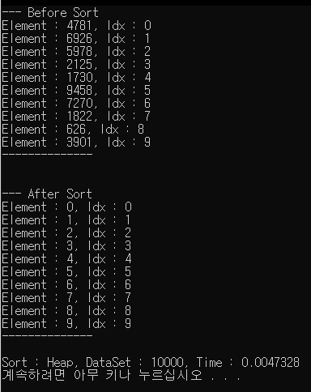

# HeapSort

이 정렬은 내가 C#에서 자주 사용하는 List.Sort()에 대해 다시 공부하고 직접 구현해보기 위함이다.

[MS List<T>.Sort 문서](https://docs.microsoft.com/en-us/dotnet/api/system.collections.generic.list-1.sort?view=netcore-3.1)

If comparison is provided, the elements of the List<T> are sorted using the method represented by the delegate.

If comparison is null, an ArgumentNullException is thrown.

This method uses Array.Sort, which applies the introspective sort as follows:

* If the partition size is less than or equal to 16 elements, it uses an insertion sort algorithm

* If the number of partitions exceeds 2 log n, where n is the range of the input array, it uses a `Heapsort algorithm.`

* Otherwise, it uses a Quicksort algorithm.

This implementation performs an unstable sort; that is, if two elements are equal, their order might not be preserved. In contrast, a stable sort preserves the order of elements that are equal.

On average, this method is an O(n log n) operation, where n is Count; in the worst case it is an O(n2) operation.

# 힙 정렬이란?

힙 정렬은 `Heap` 이라고 하는 완전이진트리 자료구조를 이용하여 `최대 힙 트리`, `최소 힙 트리`를 구성해 정렬하는 방법이다. 내림차순 정렬은 최대 힙을 구성하고 오름차순 정렬은 최소 힙을 구성한다.

[힙 정렬](https://ko.wikipedia.org/wiki/%ED%9E%99_%EC%A0%95%EB%A0%AC)

힙 정렬은 이진트리를 최대 힙으로 만들기 위해 재구성 하는 과정이 트리의 깊이만큼 이루어 지고, n 개의 데이터에 대해 정렬을 수행하므로 O(nlog^n)의 시간복잡도를 가진다.

힙 정렬은 다음과 같은 순서로 동작한다. (오름차순 기준, 위키와 동작이 조금 다름)

1. n 개의 노드에 대해 완전 이진트리를 최대 힙으로 구성한다.
2. 이 시점에 루트노드에 있는 값은 가장 큰 값이고, 해당 값을 마지막에 있는 값과 교환한 후 힙의 사이즈를 1씩 줄이면서 Heapify를 진행한다.
3. 힙의 크기가 1보다 큰 동안 `2` 번 과정을 반복한다.

## Code

```cs
// 상속 받은 Sort 클래스는 신경쓰지 않아도 된다.
class HeapSort : Sort
{
    public static void Sort(List<int> list)
    {
        int count = list.Count;
        // 최대 힙 구성
        for (int idx = count / 2 - 1; idx >= 0; idx--)
            Heapify(list, count, idx);

        // 루트에 있는 요소와 끝단에 있는 요소와 바꿔치기후 Heapify
        for(int idx = count - 1; idx > 0; idx--)
        {
            int temp = list[0];
            list[0] = list[idx];
            list[idx] = temp;

            Heapify(list, idx, 0);
        }
    }

    static void Heapify(List<int> list, int n, int idx)
    {
        // 이진 트리는 배열로도 충분히 구성이 가능하며 기본 인덱스가 '0' 이라고 가정 했을 때 왼쪽노드와 오른쪽 노드를 아래의 코드로 쉽게 표현할 수 있다.
        int largeIdx = idx;
        int leftIdx = 2 * idx + 1;
        int rightIdx = 2 * idx + 2;

        // 부모노드와 자식노드의 값 교환 과정, 부등호를 반대로 바꿀시 내림차순으로 정렬할 수 있다.
        if (leftIdx < n && list[leftIdx] > list[largeIdx])
            largeIdx = leftIdx;
        if (rightIdx < n && list[rightIdx] > list[largeIdx])
            largeIdx = rightIdx;

        // 만약 부모노드의 값이 바뀌었을 경우 자식 노드에 대해서도 Heapify를 수행해줘야 한다.
        if(largeIdx != idx)
        {
            int temp = list[idx];
            list[idx] = list[largeIdx];
            list[largeIdx] = temp;

            Heapify(list, n, largeIdx);
        }
    }
}
```

## CodeAll

```cs
class Program
{
    class HeapSort
    {
        public static void Sort(List<int> list)
        {
            int count = list.Count;
            for (int idx = count / 2 - 1; idx >= 0; idx--)
                Heapify(list, count, idx);

            for(int idx = count - 1; idx > 0; idx--)
            {
                int temp = list[0];
                list[0] = list[idx];
                list[idx] = temp;

                Heapify(list, idx, 0);
            }
        }

        static void Heapify(List<int> list, int n, int idx)
        {
            int largeIdx = idx;
            int leftIdx = 2 * idx + 1;
            int rightIdx = 2 * idx + 2;

            if (leftIdx < n && list[leftIdx] > list[largeIdx])
                largeIdx = leftIdx;
            if (rightIdx < n && list[rightIdx] > list[largeIdx])
                largeIdx = rightIdx;

            if(largeIdx != idx)
            {
                int temp = list[idx];
                list[idx] = list[largeIdx];
                list[largeIdx] = temp;

                Heapify(list, n, largeIdx);
            }
        }
    }

    public static void Print(List<int> list, int printCount)
    {
        if (list.Count < printCount)
            Console.WriteLine("'printCount' is greater than 'listCount'");

        for (int idx = 0; idx < printCount; idx++)
            Console.WriteLine("Element : {0}, Idx : {1}", list[idx], idx);
    }

    static void Main(string[] args)
    {
        int printCount = 10;
        int loopCount = 10000;
        int randomMax = 10000;
        Random random = new Random();
        Stopwatch watch = new Stopwatch();
        List<int> testData = new List<int>();

        for(int idx = 0; idx < loopCount; idx++)
        {
            int num = random.Next(0, randomMax + 1);
            if(testData.Contains(num))
            {
                idx--;
                continue;
            }

            testData.Add(num);
        }

        Console.WriteLine("--- Before Sort");
        Print(testData, printCount);
        Console.WriteLine("--------------\n");

        watch.Start();
        HeapSort.Sort(testData);
        watch.Stop();

        Console.WriteLine("\n--- After Sort");
        Print(testData, printCount);
        Console.WriteLine("--------------\n");

        Console.WriteLine("Sort : {0}, DataSet : {1}, Time : {2}", "Heap", randomMax, watch.Elapsed.TotalSeconds);
    }
}
```

## Result

10000개를 다 보여줄수는 없어서 10개만 출력한 결과

