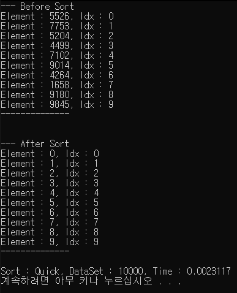

# QuickSort

이 정렬은 내가 C#에서 자주 사용하는 List.Sort()에 대해 다시 공부하고 직접 구현해보기 위함이다.

[MS List<T>.Sort 문서](https://docs.microsoft.com/en-us/dotnet/api/system.collections.generic.list-1.sort?view=netcore-3.1)

If comparison is provided, the elements of the List<T> are sorted using the method represented by the delegate.

If comparison is null, an ArgumentNullException is thrown.

This method uses Array.Sort, which applies the introspective sort as follows:

* If the partition size is less than or equal to 16 elements, it uses an insertion sort algorithm

* If the number of partitions exceeds 2 log n, where n is the range of the input array, it uses a Heapsort algorithm.

* Otherwise, it uses a `Quicksort algorithm`.

This implementation performs an unstable sort; that is, if two elements are equal, their order might not be preserved. In contrast, a stable sort preserves the order of elements that are equal.

On average, this method is an O(n log n) operation, where n is Count; in the worst case it is an O(n2) operation.

## 퀵 정렬이란?

전체 리스트에서 하나의 원소를 골라 기준값을 정한 뒤 피벗보다 작은값 과 큰값으로 구역을 나눠서 정렬한다. 이후에 구역을 나누고 정렬하는 과정을 재귀적으로 수행한다. 특정값을 기준으로 구역을 나누어 정렬하는데이 방법은 `분할 정복` 이라고도 불린다.

[퀵 정렬](https://ko.wikipedia.org/wiki/
%ED%80%B5_%EC%A0%95%EB%A0%AC)

퀵 정렬은 최악의 경우에는 O(n^2)번의 비교를 수행하고, 평균적으로 O(nlogn)의 시간복잡도를 가진다. 최악의 경우는 리스트의 대부분이 정렬이 되어있을 경우이다.

퀵 정렬의 동작은 다음과 같다. (오름차순 기준)

1. 리스트에서 하나의 원소를 고른다. 해당 원소를 피벗이라고 부른다.
2. 피벗보다 작은 값들은 리스트의 앞에, 크다면 뒤에 오도록 피벗을 기준으로 리스트를 둘로 나둔다.
3. 분할된 리스트에 대해 재귀적으로 `2` 의 과정을 반복한다.

## Code

```cs
class QuickSort
{
    public static void Sort(List<int> list, int leftIdx, int rightIdx)
    {
        // 재귀적으로 정렬을 하기 때문에 기본적인 종료조건
        if(leftIdx < rightIdx)
        {
            // 새로운 피벗을 찾는다.
            int partitionIdx = Partition(list, leftIdx, rightIdx);

            Sort(list, leftIdx, partitionIdx - 1);
            Sort(list, partitionIdx + 1, rightIdx);
        }
    }

    static int Partition(List<int> list, int leftIdx, int rightIdx)
    {
        // 비교를 수행할 기준 값인 피벗 설정
        int pivot = list[rightIdx];
        int _leftIdx = leftIdx - 1;

        // 매개변수로 데이터의 시작점과 끝지점을 순회
        for (int idx = leftIdx; idx < rightIdx; idx++)
        {
            // 피벗과 비교하여 자리교체
            if (list[idx] <= pivot)
            {
                _leftIdx++;

                int tmp = list[_leftIdx];
                list[_leftIdx] = list[idx];
                list[idx] = tmp;
            }
        }

        // 새로운 피벗을 만듦
        int _tmp = list[_leftIdx + 1];
        list[_leftIdx + 1] = list[rightIdx];
        list[rightIdx] = _tmp;

        return _leftIdx + 1;
    }
}
```

## CodeAll

```cs
class Program
{
    class InsertionSort
    {
        public static void Sort(List<int> list)
        {
            for(int idx = 1; idx < list.Count; idx++)
            {
                int current = list[idx];
                for(int secIdx = 0; secIdx < idx; secIdx++)
                {
                    if (list[idx] > list[secIdx])
                        continue;

                    int compare = list[secIdx];

                    int tmp = list[idx];
                    list[idx] = list[secIdx];
                    list[secIdx] = tmp;
                }
            }
        }
    }

    class HeapSort
    {
        public static void Sort(List<int> list)
        {
            int count = list.Count;
            for (int idx = count / 2 - 1; idx >= 0; idx--)
                Heapify(list, count, idx);

            for(int idx = count - 1; idx > 0; idx--)
            {
                int temp = list[0];
                list[0] = list[idx];
                list[idx] = temp;

                Heapify(list, idx, 0);
            }
        }

        static void Heapify(List<int> list, int n, int idx)
        {
            int largeIdx = idx;
            int leftIdx = 2 * idx + 1;
            int rightIdx = 2 * idx + 2;

            if (leftIdx < n && list[leftIdx] > list[largeIdx])
                largeIdx = leftIdx;
            if (rightIdx < n && list[rightIdx] > list[largeIdx])
                largeIdx = rightIdx;

            if(largeIdx != idx)
            {
                int temp = list[idx];
                list[idx] = list[largeIdx];
                list[largeIdx] = temp;

                Heapify(list, n, largeIdx);
            }
        }
    }

    class QuickSort
    {
        public static void Sort(List<int> list, int leftIdx, int rightIdx)
        {
            // 재귀적으로 정렬을 하기 때문에 기본적인 종료조건
            if(leftIdx < rightIdx)
            {
                // 새로운 피벗을 찾는다.
                int partitionIdx = Partition(list, leftIdx, rightIdx);

                Sort(list, leftIdx, partitionIdx - 1);
                Sort(list, partitionIdx + 1, rightIdx);
            }
        }

        static int Partition(List<int> list, int leftIdx, int rightIdx)
        {
            // 비교를 수행할 기준 값인 피벗 설정
            int pivot = list[rightIdx];
            int _leftIdx = leftIdx - 1;

            // 매개변수로 데이터의 시작점과 끝지점을 순회
            for (int idx = leftIdx; idx < rightIdx; idx++)
            {
                // 피벗과 비교하여 자리교체
                if (list[idx] <= pivot)
                {
                    _leftIdx++;

                    int tmp = list[_leftIdx];
                    list[_leftIdx] = list[idx];
                    list[idx] = tmp;
                }
            }

            // 새로운 피벗을 만듦
            int _tmp = list[_leftIdx + 1];
            list[_leftIdx + 1] = list[rightIdx];
            list[rightIdx] = _tmp;

            return _leftIdx + 1;
        }
    }

    public static void Print(List<int> list, int printCount)
    {
        if (list.Count < printCount)
            Console.WriteLine("'printCount' is greater than 'listCount'");

        for (int idx = 0; idx < printCount; idx++)
            Console.WriteLine("Element : {0}, Idx : {1}", list[idx], idx);
    }

    static void Main(string[] args)
    {
        int printCount = 10;
        int loopCount = 10000;
        int randomMax = 10000;
        Random random = new Random();
        Stopwatch watch = new Stopwatch();
        List<int> testData = new List<int>();

        for (int idx = 0; idx < loopCount; idx++)
        {
            int num = random.Next(0, randomMax + 1);
            if (testData.Contains(num))
            {
                idx--;
                continue;
            }

            testData.Add(num);
        }

        Console.WriteLine("--- Before Sort");
        Print(testData, printCount);
        Console.WriteLine("--------------\n");

        watch.Start();
        //InsertionSort.Sort(testData);
        //HeapSort.Sort(testData);
        QuickSort.Sort(testData, 0, testData.Count - 1);
        watch.Stop();

        Console.WriteLine("\n--- After Sort");
        Print(testData, printCount);
        Console.WriteLine("--------------\n");

        Console.WriteLine("Sort : {0}, DataSet : {1}, Time : {2}", "Quick", loopCount, watch.Elapsed.TotalSeconds);
    }
}
```

## Result

10000개를 다 보여줄수는 없어서 10개만 출력한 결과

