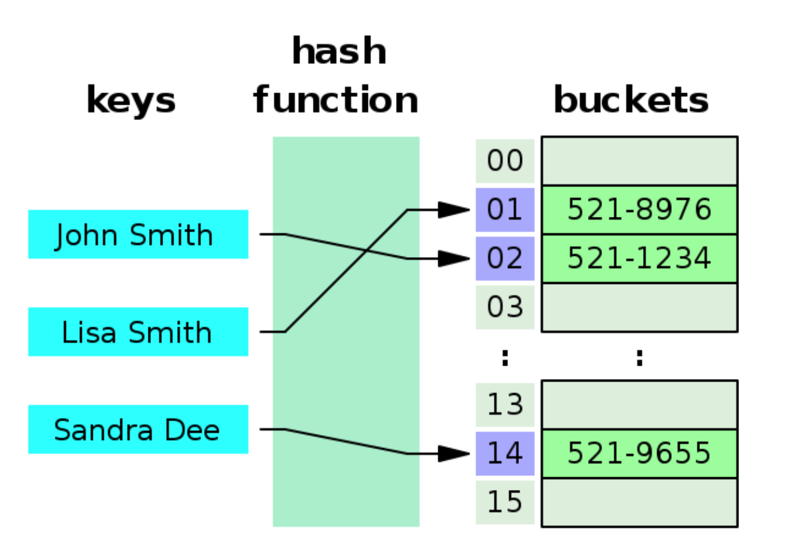
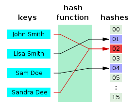

# HashTable, ArrayList

HashTable와 ArrayList에 대해 알아본다. 이 두가지 자료구조는 개인적으로 가장 많이 쓰이는 자료구조가 아닐까 싶다.

## ArrayList

크기가 동적으로 증가하는 배열, C#의 List<T> 에서 제너릭형태가 아닌 콜렉션이다.

```cs
public class ArrayList : ...
```

배열처럼 `[num]` 같은 임의접근이 가능하고, 바로 읽고 쓸수 있다. 따로 크기지정이 필요없으며 요소의 추가, 삭제에 따라 자동으로 크기가 늘어나거나 줄어든다. 제너릭 콜렉션이 아니기 때문에 모든 데이터는 object 타입으로 저장된다. 따라서 캐스팅이나 성능문제가 발생할 수 있다.

## HashTable

키의 해시값에 따라 구성된 Key/Value 한 쌍의 데이터를 저장할 수 있는 콜렉션이다. 이 자료구조의 제너릭형태가 Dictionary<T> 이다. 

현재 이 글의 작성이 이유도 HashTable의 구조를 다시 되짚어 보기 위함이다.


[출처-위키백과](https://ko.wikipedia.org/wiki/%ED%95%B4%EC%8B%9C_%ED%85%8C%EC%9D%B4%EB%B8%94)

HashTable은 키(Key), 해시함수(HashFunction), 해시값(HashValue), 값(Value) 저장소(Buckets) 로 구성되어 있다.

> Key는 HashFunction을 통해서 HashValue로 변경되며 HashValue는 Value와 매칭되어 Buckets에 저장된다.

* Key : 고유한 값이며 HashFunction의 입력이 된다.
* HashFunction : Key를 HashValue로 바꿔주는 함수, 다양한 길이를 가지고 있는 Key를 일정한 길이를 가지는 HashValue로 변경한다. 서로 다른 Key가 같은 HashValue가 되는 경우가 있으며 이를 충돌(Collision) 이라고 한다.
* HashValue : HashFunction의 결과물이며 Bucket에 Value와 매칭되어 저장된다.
* Value : Bucket에 최종적으로 저장되는 값 키와 매칭된다.

위와 같이 Key를 통해 매칭되는 Value를 찾기만 하면 되기 때문에 추가, 삭제, 조회의 과정에서 모두 평균적으로 O(1)의 시간복잡도(최악의 경우 O(n))를 가지고 있다.

HashTable은 자료구조로서 우수하지만 단점도 있다.

### Collision



위와 같은 현상을 Collision, 충돌이라고 한다. 입력으로 들어올 수 있는 Key 값은 무한하지만 저장공간은 유한하다. 그렇기에 충돌은 필연적으로 일어날 수 밖에 없다. 

따라서 충돌에 대해 여러 해결법이 존재하지만 그중 `Chaining`에 대해서만 알아보겠다.
> C#의 Dictionary가 충돌 해결방법으로 Chaining을 사용

#### Chaining


JohnSmith와 SandraDee의 해시값이 같은값을 가리키고 있다 그런데 이후에 John의 값에 Sandra를 연결시켜 버렸다.

Chaining은 저장시 충돌이 발생했다면 해당 값을 기존 값과 연결시켜 버린다. (데이터의 갯수가 적을때는 LinkedList를 많을 때는 Tree를 사용한다.)

이 충돌 해결방법의 장점으로는
1. 한정된 저장소를 효율적으로 사용 가능
2. HashFunction를 선택하는 중요성이 상대적으로 적음

단점은
1. 한 지점에 Key가 계속 연결된다면 쏠림 현상으로 인해 성능 문제가 야기된다.