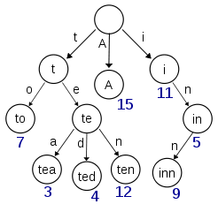

# Tree

대충 알고만 있던 트리를 다시 공부해보고자 한다.

## Tree란?

트리란 계층적인 구조를 나타내는데 자주 사용되는 자료구조로 하나 이하의 부모노드와 복수개의 자식 노드들을 가지게 된다. 이름만 들어도 나무를 연상하게 하는 자료구조로 뿌리에서 부터 잎사귀까지를 연상되게 한다.

트리에서 자주 사용되는 용어들을 정리해본다. 딱히 트리에서만 사용된다기 보다 그래프 형태의 자료구조에서 보통 쓰이는 용어들이다.

* 노드(Node) : 노드라고 하는 하나하나의 집합으로 트리가 구성된다. 보통 값과 부모 자식노드의 정보를 가지가 있다.
* 엣지(Edge) : 엣지는 노드들을 연결하는 간선으로 부모 자식 노드를 연결하게 된다.
* 루트(Root Node) : 가장 상위 노드로 부모를 가지지 않는다. 나무의 뿌리
* 리프(Leaf Node) : 가장 하위 노드로 자식을 가지지 않는다.
* 깊이(Depth) : 부모에서 자식간의 층수를 깊이라고 한다. 같은 층수의 노드 간의 깊이는 일치하며 부모에서 자식노드로 이동할때 깊이가 1 증가한다. 루트 노드는 깊이가 0이다.
* 형제노드 : 같은 부모를 가지는 자식 노드

트리의 특징으로는

1. 서로 다른 임의의 두 노드에 대해 두 노드를 연결하는 경로는 유일하다.
2. 사이클(순환구조)을 가지는 노드 집합이 존재하지 않는다.
3. 반드시 하나의 Root노드가 존재한다.(부모노드가 존재하지 않는 노드)

이러한 특징으로 인해 위에서 말했듯이 계층구조에서 자주 사용되며 쉬운 예를 들자면 컴퓨터나 스마트폰의 폴더와 파일을 생각해 볼 수 있다.
각 폴더에 대해 각 내부에 폴더 또는 파일이 있고, 이는 부모 노드와 자식 노드로 생각해 볼 수 있다.

```cs
class Program {
    class Node {
        List<Node> nodes = new List<Node>();
        string value;

        public Node(string val) {
            value = val;
        }

        public void AddNode(Node node) {
            nodes.Add(node);
        }
    }

    public static void Main() {
        Node tree = new Node("tree");
        Node node1 = new Node("node1");
        Node node2 = new Node("node2");

        tree.AddNode(node1);
        tree.AddNode(node2);

        Node leaf = new Node("leaf");
        leaf.AddNode(leaf);
    }
}
```

위 코드는 간단하게 트리를 구현해본것이고, 대부분의 기능을 생략했다 이유는 단순히 트리를 표현하고자 구현한다면 너무 크기가 커져서이다.

## Tree의 종류

트리 자료구조는 여러 종류를 가지는데 대표적으로 `Binary Tree`와 `Non-Binary Tree`로 나뉘어진다.

* Binary Tree : 이진트리로 각 노드에 대해서 두개 이하의 자식노드를 가짐을 의미한다.
* Non-Binary Tree : 이진트리와는 반대로 각 노드에 대해서 자식노드의 갯수제한이 존재하지 않는다.

먼저 `Non-Binary Tree`에 대해서 알아보고자 한다. 

### Non-Binary Tree

`Non-Binary Tree`를 가장 빈번하게 사용하는건 개인적으로 `Trie` 자료구조라고 생각한다. 보통 문자열 검색을 할때 사용된다.

문자열을 검색한다고 해보자, 단순한 방법으로는 선형 자료구조에 하나씩 넣어놓고 하나하나 비교하는것이지만 이건 매우 비효율적이다. 



위의 그림은 `Trie` 자료구조를 그림으로 나타낸 것이다. 사실 자료구조라기 보단 알고리즘에 가깝다고 볼 수 있다.

루트 노드에서 부터 't', 'te', 'ted' 와 같이 하나씩 가지치기를 하여 찾아나가는 방식이다. 특정 문자열을 찾기까지 O(n)의 시간복잡도를 가진다.

```
public class Trie
{
    public class Node
    {
        public char Char { get; private set; } // 노드에 저장될 문자

        bool isEnd; // 노드의 끝인지 여부
        List<Node> nodes = new List<Node>(); // 이어지는 문자에 대한 각 노드들

        public Node(char c)
        {
            Char = c;
        }

        public void SetEndOfString(bool isend)
        {
            isEnd = isend;
        }

        public List<Node> GetChildNodes()
        {
            return nodes;
        }
    }

    Node root = new Node(' ');

    public void InputString(string str)
    {
        char[] charArr = str.ToCharArray();
        List<Node> childNodes = root.GetChildNodes();

        Node child = null;

        for(int idx = 0; idx < charArr.Length; idx++)
        {
            // 각 문자들을 자식 노드 리스트에서 검색
            char ch = charArr[idx];
            child = childNodes.Find((x) => x.Char == ch);
            // 만약 없다면 새로 생성후 참조 변경
            if(child == null)
            {
                child = new Node(ch);
                childNodes.Add(child);
            }
            childNodes = child.GetChildNodes();
        }
        // 리프 노드 체크
        child.SetEndOfString(true);
    }

    public bool FindString(string str)
    {
        bool isExist = false;
        char[] charArr = str.ToCharArray();
        List<Node> childNodes = root.GetChildNodes();

        for(int idx = 0; idx < charArr.Length; idx++)
        {
            char ch = charArr[idx];
            Node child = childNodes.Find((x) => x.Char == ch);
            // TODO : 
        }

        return isExist;
    }
}

class Program
{
    static void Main(string[] args)
    {
        Trie trie = new Trie();
        trie.InputString("data");
        trie.InputString("datas");
    }
}
```
