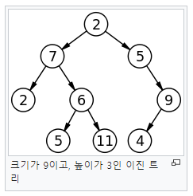
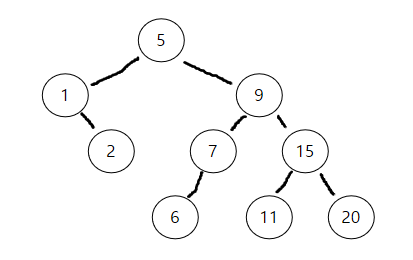

# Tree의 종류

트리 자료구조는 여러 종류를 가지는데 대표적으로 `Binary Tree`와 `Non-Binary Tree`로 나뉘어진다.

* Binary Tree : 이진트리로 각 노드에 대해서 두개 이하의 자식노드를 가짐을 의미한다.
* Non-Binary Tree : 이진트리와는 반대로 각 노드에 대해서 자식노드의 갯수제한이 존재하지 않는다.

먼저 `Non-Binary Tree`에 대해서 알아보고자 한다. 

## Non-Binary Tree

`Non-Binary Tree`를 가장 빈번하게 사용하는건 개인적으로 `Trie` 자료구조라고 생각한다. 보통 문자열 검색을 할때 사용된다.

문자열을 검색한다고 해보자, 단순한 방법으로는 선형 자료구조에 하나씩 넣어놓고 하나하나 비교하는것이지만 이건 매우 비효율적이다. 


위의 그림은 `Trie` 자료구조를 그림으로 나타낸 것이다. 사실 자료구조라기 보단 알고리즘에 가깝다고 볼 수 있다.

루트 노드에서 부터 't', 'te', 'ted' 와 같이 하나씩 가지치기를 하여 찾아나가는 방식이다. 특정 문자열을 찾기까지 O(n)의 시간복잡도를 가진다.

```cs
public class Trie
{
    public class Node
    {
        public char Char { get; private set; } // 노드에 저장될 문자

        bool isEnd; // 노드의 끝인지 여부
        List<Node> nodes = new List<Node>(); // 이어지는 문자에 대한 각 노드들

        public Node(char c)
        {
            Char = c;
        }

        public void SetEndOfString(bool isend)
        {
            isEnd = isend;
        }

        public List<Node> GetChildNodes()
        {
            return nodes;
        }
    }

    Node root = new Node(' ');

    public void InputString(string str)
    {
        char[] charArr = str.ToCharArray();
        List<Node> childNodes = root.GetChildNodes();

        Node child = null;

        for(int idx = 0; idx < charArr.Length; idx++)
        {
            // 각 문자들을 자식 노드 리스트에서 검색
            char ch = charArr[idx];
            child = childNodes.Find((x) => x.Char == ch);
            // 만약 없다면 새로 생성후 참조 변경
            if(child == null)
            {
                child = new Node(ch);
                childNodes.Add(child);
            }
            childNodes = child.GetChildNodes();
        }
        // 리프 노드 체크
        child.SetEndOfString(true);
    }

    public bool FindString(string str)
    {
        char[] charArr = str.ToCharArray();
        int length = charArr.Length;

        List<Node> childNodes = root.GetChildNodes();
        Node child = null;

        for(int idx = 0; idx < length; idx++)
        {
            char ch = charArr[idx];
            child = childNodes.Find((x) => x.Char == ch);
            // 자식 노드에서 한 문자라도 찾지 못했다면 없는것임
            if (child == null)
                return false;

            childNodes = child.GetChildNodes();
        }

        // 문자를 끝까지 찾았으며, 문자의 끝일 때 해당 문자열이 존재하는것
        return child != null && child.IsEnd;
    }
}

class Program
{
    static void Main(string[] args)
    {
        Trie trie = new Trie();
        trie.InputString("data");
        trie.InputString("datas");
    }
}
```

이외에도 `Non-Binary Tree` 컴퓨터의 파일시스템을 생각해보면 유용하게 이용됨을 알 수 있다.

## Binary Tree

`Binary Tree`는 각 노드의 자식이 2개 이하인 형태의 트리를 말한다.
이진트리라고도 하는데 활용도에 따라 여러가지로 나뉘어진다.



그중 가장 유명한 `Binary Search Tree (BST)`에 대해 알아본다.

각 노드는 자식으로 2개의 왼쪽 Subtree와 오른쪽 Subtree를 가진다.
그리고 왼쪽 Subtree에는 루트보다 낮은값들만 모여있고, 오른쪽엔 루트보다 큰값들만 모여있다. 또한 이러한 룰은 각 서브트리에도 적용된다.

왼쪽 Subtree로 내려간 순간 새로운 루트를 기준으로 왼쪽에는 루트보다 작은값이 오른쪽에는 루트보다 큰값이 위치하게 된다.

따라서 전체 트리가 정렬되어 있는 것과 같은 효과를 가지게 되어 검색에 있어 선형 자료구조처럼 순차적으로 모든 노드를 검색하는 O(n)이 아니라, 매 검색마다 검색영역을 전반으로 줄여 O(logn)의 시간복잡도를 가지게 된다.

이러한 조건을 만족하는 것이 `Binary Search Tree` 이다.

```cs
class Node
{
    public int value;
    public Node left;
    public Node right;

    public Node(int val)
    {
        value = val;
    }
}

class BinaryTree
{
    Node root;

    public void Insert(int val)
    {
        if(root == null)
        {
            root = new Node(val);
        }
        else
        {
            Node node = root;
            while(node != null)
            {
                int res = node.value.CompareTo(val);
                if(res == 0)
                {
                    // 같은 값은 존재할 수 없다.
                    break;
                }
                else if (res > 0)
                {
                    if(node.left == null)
                    {
                        node.left = new Node(val);
                        break;
                    }
                    node = node.left;
                }
                else
                {
                    if(node.right == null)
                    {
                        node.right = new Node(val);
                        break;
                    }
                    node = node.right;
                }
            }
        }
    }

    public void Print()
    {
        TraverseRecursive(root);
    }

    void TraverseRecursive(Node node)
    {
        if (node == null) return;

        Console.WriteLine(node.value);
        TraverseRecursive(node.left);
        TraverseRecursive(node.right);
    }
}

class Program
{
    static void Main(string[] args)
    {
        BinaryTree bst = new BinaryTree();
        bst.Insert(5);
        bst.Insert(9);
        bst.Insert(1);
        bst.Insert(7);
        bst.Insert(2);
        bst.Insert(15);
        bst.Insert(6);
        bst.Insert(11);
        bst.Insert(20);

        bst.Print();
    }
}
```



해당 코드의 결과를 그림으로 그려보았다.

// TODO : RedBlackTree