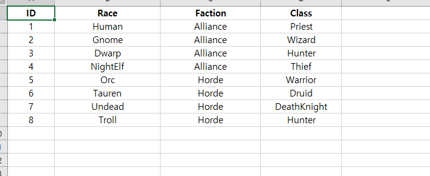
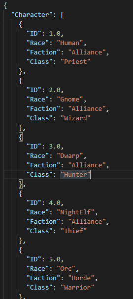

# Sample

* `엑셀(xls, xlsx)` 파일을 `Json` 으로 변환해주는 프로그램, C# 으로 작성
* 대부분의 게임은 엑셀을 기반으로 작성된 데이터를 가지고 게임에 사용하기에 코드 구조 및 확장이 쉬운 코드 관련해서 공부할 겸 작성 시도
* 완성은 했으나 기대했던 결과가 나왔는지는 잘 모르겠음
* 결과물이 Json이기 때문에 프로젝트에 Json 파서가 있어야 함
* 현재 프로젝트에서 데이터를 관리하는 방법에 따라 코드가 수정되어야 할 수도 있음 예를 들면 현재 코드는 엑셀파일이 하나던 여러개든 한개의 Json으로 만들고 있는데 프로젝트에 따라 여러개가 나와야 할수도

## SampleData.xlsx

## Result.json

* `"Character"`는 '시트 이름' 특정 시트를 문자열로 구분해서 파싱할 방법이 필요할 것 같았음 하위 요소들도 같은 이유
* 엑셀 파일의 각 행들이 하나의 클래스로 생성될 것을 예상해서 각 값들도 문자열로 바로 파싱할 수 있어야 할 것 같았음 예를 들면 dictionary["ID"] 같이
