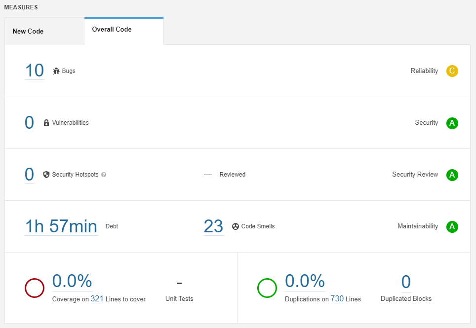
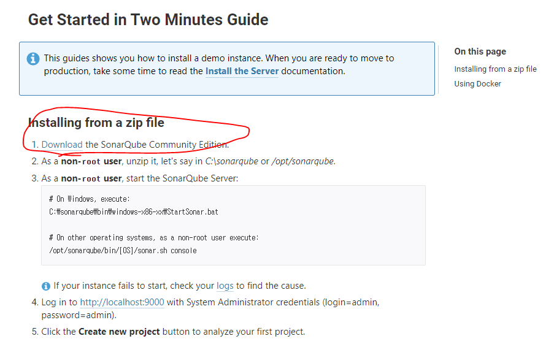
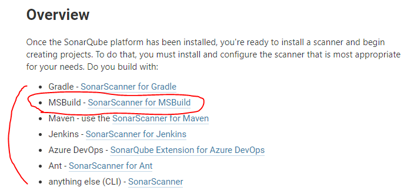
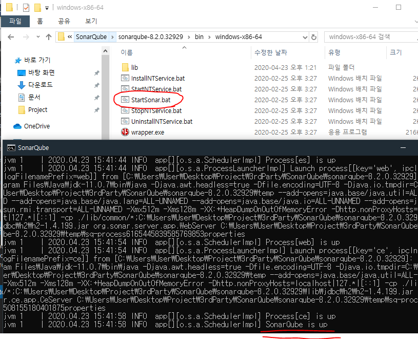
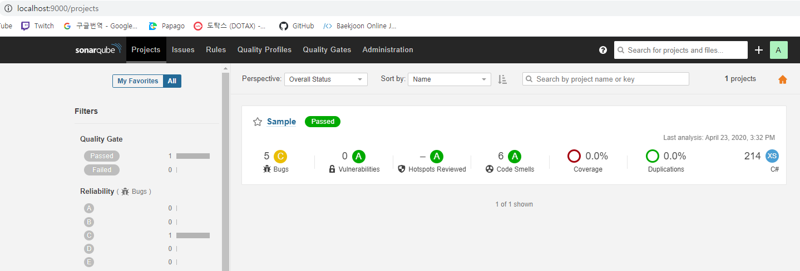
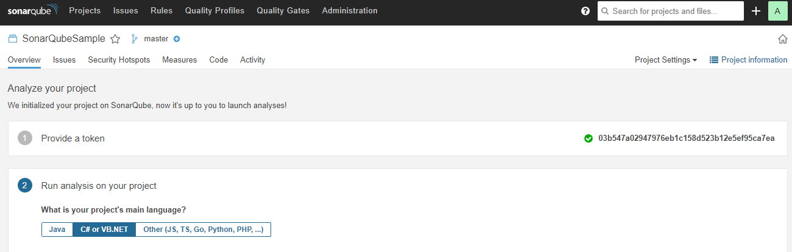
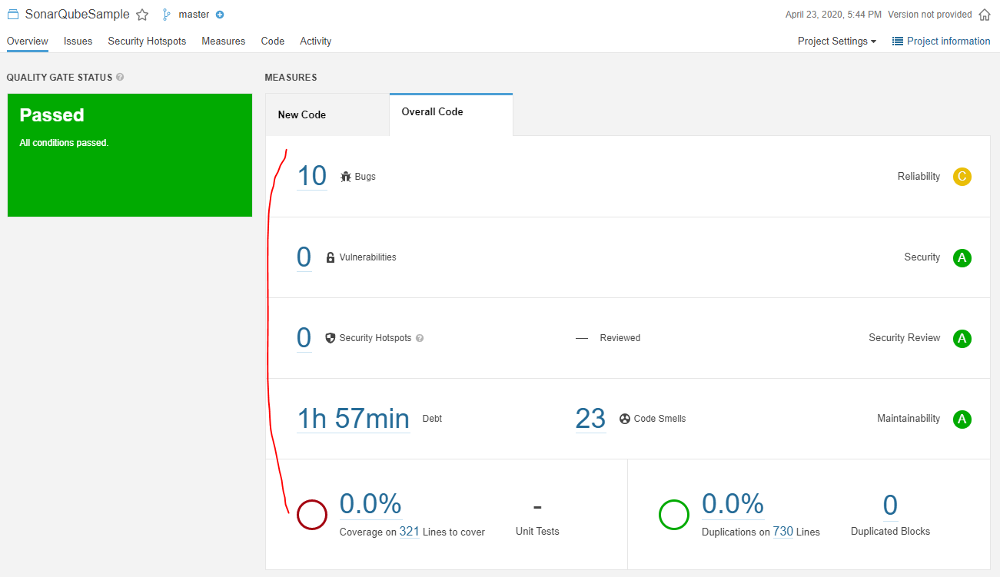

# [SonarQube](https://www.sonarqube.org/)

개인적으로 코드 피드백은 무조건 해야한다고 생각하는 편인데 여건이 되지 않거나 시간상의 문제로 못할때가 많다. 또한 혼자 공부하는 경우 자신의 코드에 문제점이 있어도 찾기가 굉장히 힘들기 때문에 이전에 코드분석 도구를 알아보던 중 `소나큐브` 라는 도구를 알게되었고, 다시 한번 알아보고자 한다.

`소스코드 정적 분석` 은 실제 프로그램을 실행하지 않고, 코드만의 형태에 대한 분석을 말한다. 코드가 내포하고 있는 취약점이나 위험성이 있거나 코딩 표준, 일반적으로 약속된 규칙같은걸 준수하는지에 대한 분석을 말한다.

여러가지 코드 분석도구가 있지만 그중에서 예전부터 눈여겨본 소나큐브라는 도구를 소개하고, 사용법에 대해 알아보고자 한다.

소나큐브는 20개 이상의 언어를 지원하고, `버그`, `코드 스멜(버그가 발생할 가능성이 있는)`, `보안 취약점`이 있는 코드를 발견할 목적으로...이하 생략

[소나큐브 위키백과](https://ko.wikipedia.org/wiki/%EC%86%8C%EB%82%98%ED%81%90%EB%B8%8C)

소나큐브의 주요 기능은 다음과 같다.

1. 복잡도 확인
2. 코드 중복 검출
3. 코딩 규칙 확인
4. 잠재적 버그 검출
5. 단위 테스트
6. [커버리지](https://ko.wikipedia.org/wiki/%EC%BD%94%EB%93%9C_%EC%BB%A4%EB%B2%84%EB%A6%AC%EC%A7%80)

주요 특징은 다음과 같다.

1. 20개 이상의 프로그래밍 언어 분석이 가능하다.
2. 오픈소스이다.
3. 완전 자동화된 분석과 Maven, Gradle, MSBuild, CI 도구와의 연동을 제공한다.
4. 3번과 연계하여 마켓플레이스에서 여러가지 플러그인을 다운받아 Git 호스팅 사이트와의 연동도 가능하다.


*웹페이지 에서 분석 결과를 한눈에 볼 수 있다.*

## How to Use

기본적으로 소나큐브는 서버와, 분석도구 두가지로 나뉘어진다.

서버는 크게 웹서버, 검색서버, 연산서버로 구성된다. (이쪽은 잘 모름) 소나큐브 스캐너라고 하는 분석도구로 코드를 분석하고 결과를 서버에 전송해서 웹에서 확인하는 방식이다.

기본적으로 Documentation문서가 있고, 설명도 나름 친절한 편이지만 은근 삽질을 했기 때문에 사용하는법을 기록해둔다.

### Prerequisites

환경변수 등록방법은 설명하지 않는다.

* _JDK 11 혹은 그 이상의 버전 필요 및 환경변수 등록_, 유니티의 OpenJDK를 사용하려고 했으나 소나큐브 서버를 구동시키기 위해서는 JDK 11 이상의 버전을 요구하였다.
* MsBuild 환경변수 등록, VisualStudio를 사용하고 있다면 설치폴더에 찾으면 있음
* SonarScanner 환경변수 등록, 그냥 편의를 위해 등록 안그러면 나중에 커맨드창으로 실행할 때 fullPath 넣어야됨

### Environment

| OS | Platform |
|:---|:--------|
| Windows 64bit| MSBuild |

### Flow

1. 로컬상에서 가동시킬 소나큐브 서버를 다운받는다.



2. 본인의 목적에 맞는 분석 도구를 다운받는다. 나는 유니티 프로젝트에 대해 분석을 하려고 했었어서 `MSBuild-NET Framework 4.6+`를 다운받았다. 이외에도 `.NET Core 2.0+`, `.NET Core Global Tool` 두가지가 더 있지만 무슨 차이인지 정확히 몰라서 Framework를 다운받았다.



3. 편하게 사용하려면 같은 폴더에 놓고 압축을 해제하고 SonarScanner 폴더에 있는 `SonarQube.Analysis.xml` 를 다음과 같이 편집한다. 사실 이유는 정확히 모르는데 단순히 로컬에서 사용하는 거라면 크게 상관 없어 보였다. 그렇게 생각하는 이유는 나중에 나옴

```xml
<!-->
소나 스캐너의 전역세팅을 담당하는 xml로 추측된다.
편집기를 통해 xml을 열게 되면 밑에 Property들이 주석처리되어 있다.
login과 password는 소나큐브 웹에서 디폴트로 admin/admin이라고 설정 되어있다길래 그대로 옮겨놓았다.
<-->

<SonarQubeAnalysisProperties  xmlns:xsi="http://www.w3.org/2001/XMLSchema-instance" xmlns:xsd="http://www.w3.org/2001/XMLSchema" xmlns="http://www.sonarsource.com/msbuild/integration/2015/1">

  <Property Name="sonar.host.url">http://localhost:9000</Property>
  <Property Name="sonar.login">admin</Property>
  <Property Name="sonar.password">admin</Property>

</SonarQubeAnalysisProperties>
```

4. 소나큐브 서버 폴더/bin/windows 로 들어가서 StartSornar.bat을 실행시키고 소나큐브 서버가 완전히 가동 됐다면 인터넷 주소창에 `localhost:9000` 웹페이지를 띄운 후 `admin/admin`으로 로그인한다. 다른 os의 경우 소나큐브 홈페이지에 나와있으니 참고





5. 신규 프로젝트를 하나 만들고 토큰을 만들면 분석 준비 끝, 개인적으로 토큰은 따로 기록해놓는게 나중에 편하다.



6. C# 솔루션이 있다고 가정하고, 커맨드창을 열어서 다음과 같은 명령어를 입력한다. 당연히 경로는 자신의 환경에 맞게 바뀌어야 한다. 나는 일일이 치기 귀찮아서 .bat 으로 만들었다.

```
// 1. 분석도구 실행 : `begin` 이라는 명렁어로 분석을 시작하게 되고, 파라미터로 처음 프로젝트 만들때 넣었던 Key 즉, 이름이랑 서버 url, id와 pw를 넣어준다.

SonarScanner.MSBuild.exe begin /k:"SonarQubeSample" /d:sonar.host.url="http://localhost:9000" /d:sonar.login="admin" /d:sonar.password="admin"

// 2. 코드 빌드 : 나는 C# 코드를 분석하고 싶기 때문에 그냥 솔루션을 빌드하면 된다. 소나큐브 Doc 문서에서는 저 `Rebuild` 옵션을 넣어주라는데 안넣어줘도 딱히 상관 없는듯

msbuild C:\Users\User\Desktop\Project\Study\ExternalTools\SonarQubeSample\SonarQubeSample.sln /t:Rebuild

// 3. 분석도구 종료 : `end` 라는 명령어로 종료를 알린다. 똑같이 id/pw 를 파라미터로 넘겨준다.
3.
SonarScanner.MSBuild.exe end /d:sonar.login="admin" /d:sonar.password="admin" 
```

7. 웹페이지로 가서 분석된 결과를 확인한다.



후기 : 생각보다 좋은 분석 플랫폼인것 같다. 잘만 활용하면 코드의 품질을 높이는데에 충분히 기여를 할 수 잇을것 같다는 생각이 든다.

나중에 좀더 고급지게 활용한다면 Github에 연동을 하거나 젠킨스에 연동을 시도해봐야 겠다.

이후에는 소나큐브 웹에서 각 항목이 무엇을 뜻하는지 알아본다.