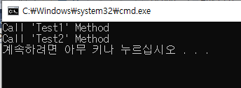

# ConditionalAttribute 클래스

* 네임스페이스:System.Diagnostics
* 어셈블리:mscorlib.dll, System.Runtime.dll
* [ConditionalAttribute Ref](https://docs.microsoft.com/ko-kr/dotnet/api/system.diagnostics.conditionalattribute?view=net-5.0)

## Conditional이란?

지정된 기호가 정의되어 있지 않으면 함수 호출이 무시되도록 컴파일러에게 알려주는 어트리뷰트

## Example

```cs
#define COND1 // 'define' 으로 기호 정의
#define COND2

using System;
using System.Diagnostics;

namespace ConsoleApp1
{
    class Program
    {
        static void Main(string[] args)
        {
            // 3개의 함수를 호출하는데 Conditional 어트리뷰트로 기호를 지정해놓았다.

            Test1();
            Test2();
            Test3();
        }

        [Conditional("COND1")]
        public static void Test1()
        {
            Console.WriteLine("Call 'Test1' Method");
        }

        [Conditional("COND2")]
        public static void Test2()
        {
            Console.WriteLine("Call 'Test2' Method");
        }

        // 'COND3'은 따로 정의되지 않았기 때문에 컴파일시 무시된다.
        [Conditional("COND3")]
        public static void Test3()
        {
            Console.WriteLine("Call 'Test3' Method");
        }
    }
}
```

## Result

