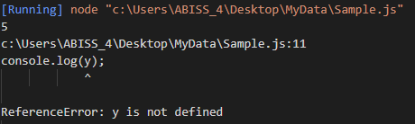
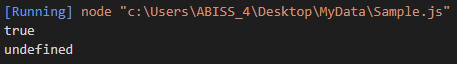
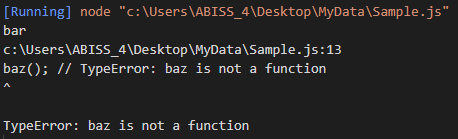
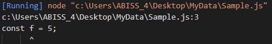

# JavaScript

자바 스크립트는 객체 지향의 스크립트 프로그래밍 언어이다. 주로 웹 브라우저 내에서 사용하며 Node.js와 같이 서버측 언어로도 사용되고 있다.

`CloudScript` 관련해서 사용할 일이 있어 기본적인 문법을 여기에 정리해둔다.

# 개발 환경

* Visual Studio Code
    * VS Code Extension, Code Runner
    * VS Code Extension, ESLint
* Node.js 14.15.1

주 언어가 아닌 서브 언어를 사용할 때 VS Code를 주로 사용했었고, 에디터 자체가 프로그래밍 관련해서 범용적인 부분을 다루기 때문에 공부하기에도 좋다.

웹 브라우저에서 JavaScript를 다루기 위해 공부하는 것이 아니고, 로직 작성을 위한 것이며 또 잘 모르기도 해서 그냥 Node.js를 설치해서 사용한다.

## 기본 문법, 변수, 자료형

JavaScript는 대소문자를 구별하며 유니코드 문자셋을 이용한다.
따라서 다음과 같은 코드가 유효한다.

```js
var 갑을 = "병정";

var value = "12345";
var Value = "ABCDE";
```

하지만 `value`와 `Value`는 다르다. 대소문자를 구분하기 때문

JavaScript 에서는 명령을 `명령문(Statement)` 라고 부르며, 세미콜론(`;`) 으로 구분한다.

JavaScript의 스크립트 소스는 왼쪽에서 오른쪽으로 탐색하면서 토큰, 제어 문자, 줄바꿈 문자, 주석이나 공백으로 이루어진 입력 element의 시퀀스로 변환된다. 스페이스, 탭, 줄바꿈 문자는 공백으로 간주 된다.

### 주석

주석은 C++ 및 기타 다른 언어와 똑같다.

```js
// 한 줄 주석
/* 긴 주석
 * 여러 줄 주석
*/
```

주석은 공백처럼 판단되고, 스크립트 실행 시 버려진다.

### 선언

JavaScript의 선언에는 3가지 방법이 존재한다.

> var
* 변수를 선언과 동시에 값을 초기화

>let
* 블록 범위(scope) 지역 변수를 선언과 동시에 값을 초기화

>const
* 블록 범위 읽기 전용 상수 선언

### 변수

특정 값에 상징적인 이름으로 변수를 사용한다. 변수 명은 `식별자(Identifier)`라고 불리며 특정 규칙을 따른다.

네이밍의 경우 기호에 따라 달라지지만 보통 `Number_hits`, `temp99`, `$credit`, `_name` 등으로 쓰여진다.

### 변수 선언

변수 선언은 3가지의 방법이 있다.

```js
var x = 42 // 이 구문은 지역 및 전역 변수를 선언하는데 모두 사용 될 수 있다.
let y = 13 // 이 구문은 블록 범위 지역 변수를 선언하는데 사용 될 수 있다.
x = 42 // 이 구문은 선언되지 않는 전역변수를 만든다. 하지만 사용을 권고하진 않는다.
```

### 변수 할당

지정된 초기값 없이 `var` 혹은 `let` 문을 사용해서 선언된 변수를 `undefined` 값을 갖는다.

선언되지 않는 변수에 접근을 시도하는 경우 `ReferenceError` 예외가 발생한다.

```js
var a;
console.log("a 값은 " + a);

console.log("b 값은 " + b);
var b;

console.log("c 값은 " + c);

let x;
console.log("x 값은 " + x);

console.log("y 값은 " + y);
let y;
```

* 결과


`undefined`를 사용하여 변수값이 있는지 확인할 수 있다. 아래 코드에서 `input` 변수는 값이 할당되지 않았고, `if`문은 `true`로 평가된다.

```js
var input;
if(input == undefined)
    console.log("input is undefined");
else
    console.log("input has a value");
```

* 결과


`undefined` 값은 `boolean` 문맥(context)에서 사용될 때 `false`로 동작한다.

```js
var tempArr = [];
if(!tempArr[0])
    console.log("Hello World");
```

* 결과


`undefined` 값은 수치 문맥에서 사용될 때 `NaN`으로 변환된다.

```js
var a;
console.log(a + 2);
```

* 결과


`null` 값을 평가할 때, 수치 문맥에서는 `0` 으로 `boolean` 문맥에서는 `false`로 동작한다.

```js
var n = null;
console.log(n * 32);

if(!n)
    console.log("n is null");
```

* 결과


### 변수 범위

JavaScript에도 전역변수 지역변수 라는 개념이 존재한다.
해당 기준은 함수의 외부에 있냐 내부에 있냐의 차이이다.

하지만 어떤 키워드를 사용하느냐에 따라 달리지기도 한다.

```js
if(true)
{
    var x = 5;
}
console.log(x);

if (true) 
{
    let y = 5;
}
console.log(y);
```

* 결과



### 변수 호이스팅

JavaScript의 특징중 한가지로 나중에 선언된 변수를 예외를 받지 않고도 참조가 가능하다. 이를 `호이스팅(hoisting)` 이라고 한다. 어떤 변수를 "끌어올린다." 라는걸 뜻하는데 끌어올려진 변수는 `undefined` 값을 반환한다.

```js
console.log(x == undefined);
var x = 3;

/****************************/

var myvar = "my value";

(function() 
{
    console.log(myvar); // undefined
    var myvar = "local value";
})();
```

* 개인적인 생각

두번째 구문의 경우 함수 내에 `var` 키워드로 선언된 변수가 상단으로 '끌어올려져'서 undefined 값이 되는것 같다. 즉 블록 외부에 같은 이름의 `var` 키워드로 선언된 변수가 있을 경우 무시되고 블록 내의 변수가 호이스팅 되어 `undefined` 값이 출력 되는듯 하다.

* 결과



위 코드는 아래 예제와 동일하다고 볼 수 있다.

```js
/**
 * Example 1
 */
var x;
console.log(x === undefined); // logs "true"
x = 3;

/**
 * Example 2
 */
var myvar = "my value";

(function() 
{
    var myvar;
    console.log(myvar); // undefined
    myvar = "local value";
})();
```

호이스팅 대문에 함수 내의 모든 `var` 문은 가능한 함수 상단 근처에 두는 것이 좋다. 이 방법은 코드를 더욱 명확하게 만들어준다.

### 함수 호이스팅

함수에서는 단지 함수 선언만 상단으로 '끌어올려'지고 함수 표현식은 그렇지 않다.

```js
/* 함수 선언 */

foo(); // "bar"

function foo() 
{
     console.log('bar');
}


/* 함수 표현식 */

baz(); // TypeError: baz is not a function

var baz = function() 
{
    console.log('bar2');
};
```

* 결과



## 상수

`const` 키워드로 읽기 전용 상수를 만들 수 있다. 상수 식별자의 구문은 변수 식별자의 구문과 같다.

```js
const PI = 3.14;
```

상수는 스크립트가 실행 중인 동안 대입을 통해 값을 바꾸거나 할당 할 수 없다.

상수에 대한 범위 규칙은 `let` 블록 범위 변수와 동일하다. 만약 `const` 키워드가 생략된 경우에는, 식별 자는 변수를 나타내는 것으로 간주한다.

상수는 같은 범위에 있는 함수나 변수와 동일한 이름으로 선언할 수 없다.

```js
// 오류가 발생합니다
function f() {};
const f = 5;

// 역시 오류가 발생합니다
function f() {
    const g = 5;
    var g;

  //statements
}
```

* 결과



그러나, 상수에 할당된 객체의 속성은 보호되지 않아서 다음의 문은 문제없이 실행된다.

```js
const MY_OBJECT = {'key': 'value'};
MY_OBJECT.key = 'otherValue';
```

또한 배열의 내용도 보호되지 않아서 다음의 문제 문제없이 실행된다.

```js
const MY_ARRAY = ['HTML','CSS'];
MY_ARRAY.push('JAVASCRIPT');
console.log(MY_ARRAY);
```

## 데이터 구조 및 형

### 데이터형

최신 ECMAScript 표준은 7가지 데이터 형을 정의한다.

* 6가지의 원시 데이터 형
    * Boolean, true와 false
    * null, null 값을 나타내는 특별한 키워드
    * undefined, 값이 저장되어 있지 않은 최상위 속성
    * Number, 정수 또는 실수형 숫자
    * String, 문자열
    * Symbol 인스턴스가 고유하고 불변인 데이터 형 -> ?
* Object

### 자료형 변환

JavaScript는 동적 형지정 언어다. 즉 변수를 선언할 때 데이터 형을 지정할 필요가 없음을 의미한다. 또한 데이터 형이 스크립트 실행 도중 필요에 의해 자동으로 변환됨을 뜻한다.