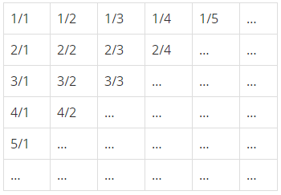
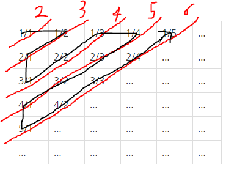

## [1193 분수찾기](https://www.acmicpc.net/problem/1193)

## 문제

무한히 큰 배열에 다음과 같이 분수들이 적혀있다.



이와 같이 나열된 분수들을 1/1 -> 1/2 -> 2/1 -> 3/1 -> 2/2 -> … 과 같은 지그재그 순서로 차례대로 1번, 2번, 3번, 4번, 5번, … 분수라고 하자.

X가 주어졌을 때, X번째 분수를 구하는 프로그램을 작성하시오.

## 입력

첫째 줄에 X(1 ≤ X ≤ 10,000,000)가 주어진다.

## 출력

첫째 줄에 분수를 출력한다.

## 풀이

분수들이 지그재그 순서로 대각선을 따라 나열되는데 해당 대각선에 있는 분수들의 분자 분모의 합이 똑같다.

위 내용을 이용해서 구하고자 하는 분수가 `몇번째 대각선에 있는지, 분모 분자의 합이 얼마인지` 로 풀이를 시작한다.



먼저 구하고자 하는 분수가 몇번째 대각선에 위치하는지를 구한다.

위 표를 보면 각 대각선에 위치하는 분수들의 갯수가 1부터 하나씩 늘어나는것을 확인할 수 있기에 1부터 숫자들을 누적시켜서 위치하는 대각선을 구할 수 있다.

분모 분자는 구하고자 하는 분수가 위치한 대각선이 짝수, 홀수 번째인지에 따라 초기값 및 연산이 달리지기에 짝,홀에 따라 연산을 달리하여 현재 대각선에 위치한 분수의 총 갯수를 하나씩 줄여나가면 원하는 분수를 구할 수 있다.

### Code

```cs
using System;

namespace ConsoleApp1
{
    class Program
    {
        private static void Main(string[] args)
        {
            Solve();
        }

        private static void Solve()
        {
            int inputNum = int.Parse(Console.ReadLine());

            int totalCount = 0, lineNumber = 1;

            while (true)
            {
                totalCount += lineNumber;
                if (totalCount >= inputNum)
                    break;

                lineNumber++;
            }

            bool isEven = (lineNumber + 1) % 2 == 0;
            int child = isEven ? 1 : lineNumber;
            int parent = isEven ? lineNumber : 1;

            while(true)
            {
                if (totalCount == inputNum)
                    break;

                child = isEven ? child + 1 : child - 1;
                parent = isEven ? parent - 1 : parent + 1;

                totalCount--;
            }

            Console.WriteLine("{0}/{1}", child, parent);
        }
    }
}
```