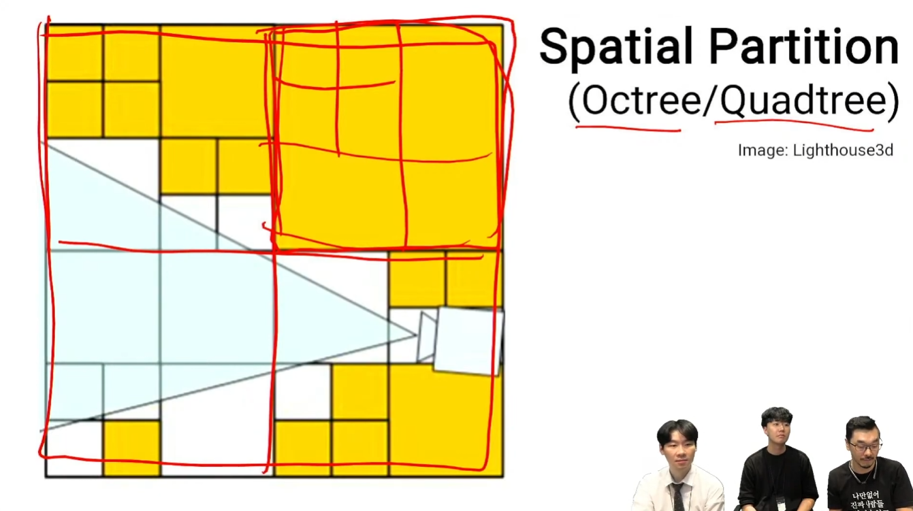
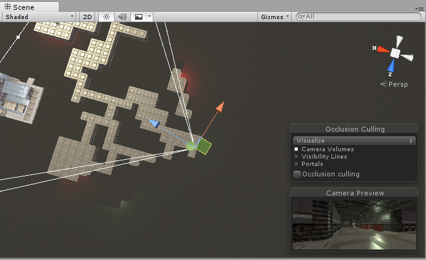
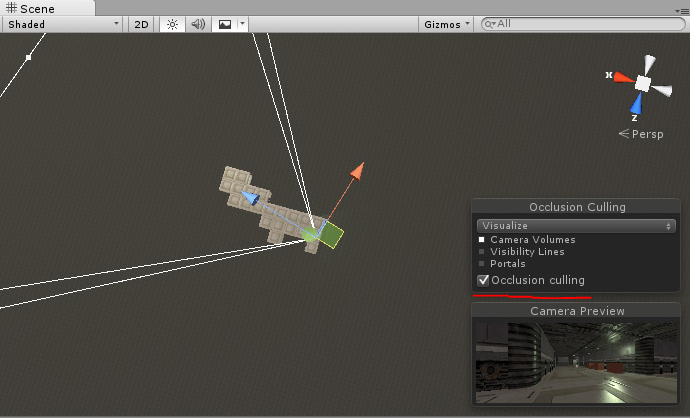
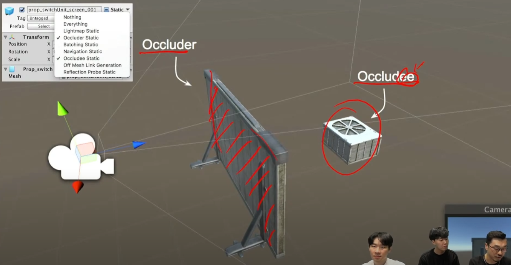

# 카메라 컬링에 대한 이해

## 목차

1. MVP Transformation
2. Frustum Culling
3. Spatial Partition
4. Occlusion Culling

## 참고자료

https://youtu.be/O0qliGO7Oes?si=V2Nj5yP3hZbXC5TE

---

* `컬링`이란? 

    > 보이지 않는 것을 그리지 않는 것

그렇다면 물체를 화면에 그리기 위해 어떤 동작이 필요한지 간단하게 짚고 넘어간다.

### MVP Transformation

물체가 위치한 좌표를 화면상에 표현하기 위해 다음과 같은 좌표 변환을 거친다.

1. 모델 변환 (Model Transformation) : 객체를 `로컬 좌표계`에서 `월드 좌표계`로 변환 한다.

    > 객체를 화면상에 배치하고 이동, 크기, 회전을 하기 위해서는 절대적인 위치를 나타내는 `월드 좌표계`로 변환해야 함

2. 뷰 변환 (View Transformation) : `월드 좌표계`에서 `카메라 좌표계`로 변환 한다.

    > 절대적인 위치에 배치되어도 카메라를 기준으로 화면을 바라보기에 카메라의 위치와 방향을 기준으로 변환한다

3. 투영 변환 (Projection Transformation) : `카메라 좌표계`에서 `클립 좌표계`로 변환 한다.

    > 사람은 모니터(2D)를 통해서 보기에 3D 좌표를 특정 범위로 `정규화`한다. 이 과정에서 `원근 투영`을 할지 `직교 투영`을 할지 적용됨

최종적으로 클립 좌표를 `화면 공간 변환`을 통해 스크린 좌표로 최종 렌더링 된다.

### Frustum Culling

이미지 참조 : <https://learnopengl.com/Guest-Articles/2021/Scene/Frustum-Culling>

* 뷰 절두체(View Frustum)라고 하는 카메라의 시야를 정의하는 영역 외 바깥 공간은 렌더링 하지 않는것, 해당 영역 내부에 있어야 화면에 렌더링한다.

### Spatial Partition

이미지 참조 : <https://youtu.be/O0qliGO7Oes?si=DCeN_IQ5PwDIlC0i&t=1406>

* 컬링을 할 때 매번 모든 오브젝트를 검사 하는게 아니라 `공간 분할`이라는 기법을 사용하여 각 영역을 나누어 절두체와 겹치거나 근처의 블록만 검사함

* 보통 2D는 Quadtree, 3D는 Octree 방법을 사용

### Occlusion Culling

이미지 참조 : <https://docs.unity3d.com/Manual/OcclusionCulling.html>

* 가려지는건 렌더링 하지 않는것

* 보통 1인칭 시점의 폐쇄된 공간을 렌더링 할때 효과적이며 넓은 시야각과 광활한 공간에선 역효과가 나타날수도 있음

이미지 참조 : <https://youtu.be/O0qliGO7Oes?si=-qUf_2FsYTwqJYdE&t=1827>

* 유니티 엔진에선 Occluder(가림판) Occludee(가림 당하는? 물체)를 따로 설정하게 되어있다.