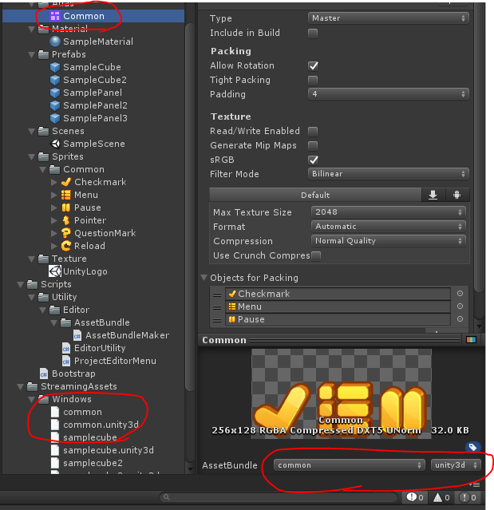
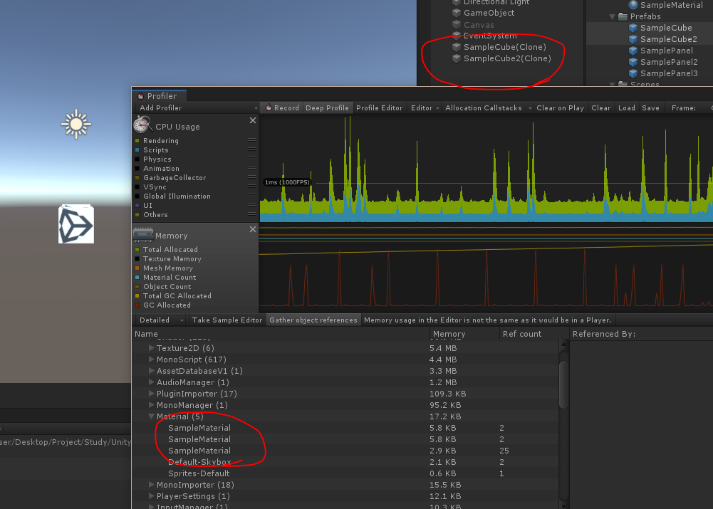

# AssetBundle

대충 알고만 있던 애셋번들에 대해서 조사하고, 실제 사용시 유의점에 대해서 알아보자

## 애셋번들이란?

애셋번들은 특정 플랫폼을 타겟으로한 유니티만의 압축 포맷이다. 프리팹, 텍스쳐, 사운드 클립 등 어떤것이든 애셋번들의 대상이 될 수 있다.

애셋번들을 사용하는 이유는 초기 설치 크기를 줄이고, 유저의 플랫폼용으로 리소스의 로딩이 최적화되며, 런타임 메모리의 압박이 줄어든다. 또한 CDN에 애셋번들을 업로드 해놓으면 원격으로 애셋번들을 다운받아 플레이 할 수 있다. 현재 게임의 대부분이 원격으로 다운받는 패치의 형태를 띄고 있다.

[유니티 애셋번들](https://docs.unity3d.com/kr/2018.4/Manual/AssetBundlesIntro.html)



## 애셋번들 종속성

애셋번들에 속한 오브젝트중 하나 이상이 다른 번들에 있는 오브젝트에 대한 참조를 가지고 있을 경우 해당 애셋번들은 다른 애셋번들에 종속된다. 

포함되어 있지 않은 경우 종속관계가 형성되지는 않지만, 종속하는 오브젝트가 애셋번들이 빌드되는 번들로 복사된다.

애셋번들이 종속성을 가지고 있을 경우 인스턴스화 하려는 오브젝트가 로딩되기 전에 종속성을 가지는 번들이 로드되도록 해야한다.

[유니티 애셋번들 종속성](https://docs.unity3d.com/kr/2018.4/Manual/AssetBundles-Dependencies.html)

## 애셋번들 빌드

애셋번들을 빌드하려면 무조건 스크립트로 제어해야 한다.

```cs
AssetBundleBuild build = new AssetBundleBuild();
build.assetBundleName;
build.assetBundleVariant;
build.assetNames;

// ...

if (assetBundleList.Count == 0)
    BuildPipeline.BuildAssetBundles(outputPath, buildOption, buildTarget);
else
    BuildPipeline.BuildAssetBundles(outputPath, assetBundleList.ToArray(), buildOption, buildTarget);
```

`BuildPipeline.BuildAssetBundles()` 라는 함수를 통해 애셋번들을 빌드할 수 있으며, 기본적으로 현재 애셋번들로 등록된 오브젝트들을 전부 빌드한다. 전부 빌드할경우 기존의 애셋번들이 존재하는데 바뀐게 없다면 빌드를 하지 않는 처리까지 해준다.

만약 특정한 오브젝트만 애셋번들로 빌드하고 싶다면 `AssetBundleBuild`라는 구조체를 채워서 매개변수로 넣어주면 된다.

## 애셋번들 매니페스트

Cube1.prefab -> CubeMaterial.material -> CubeTexture.png
Cube2.prefab -> 위와 동일 -> 위와 동일

위와 같이 Cube1과 Cube2가 하나의 매테리얼을 참조하고 있을 경우 Cube1과 Cube2만 애셋번들로 만들면 CubeMaterial이 각각의 애셋번들로 복사되어 빌드되기 때문에 결과적으로 2개의 CubeMaterial을 생성하게 된다. 그리하여 애셋번들의 크기가 늘어나고 사용하는 메모리도 2배가 된다.

