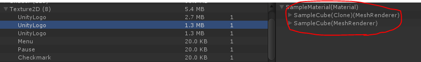
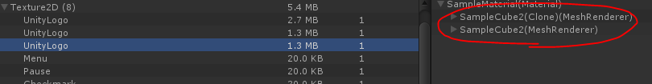
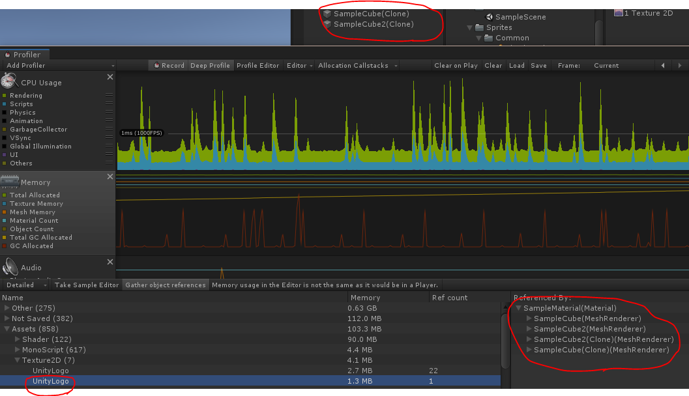
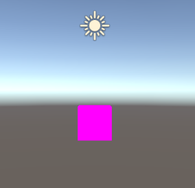
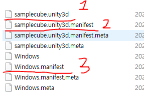
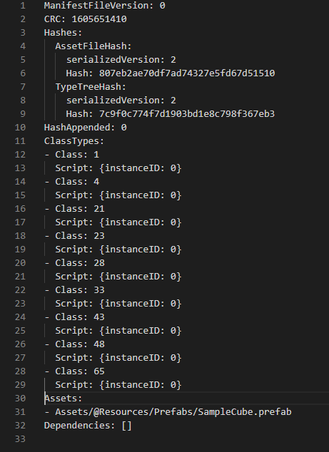
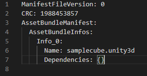

# AssetBundle

대충 알고만 있던 애셋번들에 대해서 조사하고, 실제 사용시 유의점에 대해서 알아보자

## 애셋번들이란?

애셋번들은 특정 플랫폼을 타겟으로한 유니티만의 압축 포맷이다. 프리팹, 텍스쳐, 사운드 클립 등 어떤것이든 애셋번들의 대상이 될 수 있다.

애셋번들을 사용하는 이유는 초기 설치 크기를 줄이고, 유저의 플랫폼용으로 리소스의 로딩이 최적화되며, 런타임 메모리의 압박이 줄어든다. 또한 CDN에 애셋번들을 업로드 해놓으면 원격으로 애셋번들을 다운받아 플레이 할 수 있다. 현재 게임의 대부분이 원격으로 다운받는 패치의 형태를 띄고 있다.

[유니티 애셋번들](https://docs.unity3d.com/kr/2018.4/Manual/AssetBundlesIntro.html)


## 애셋번들 빌드

애셋번들을 빌드하려면 무조건 스크립트로 제어해야 한다.

```cs
AssetBundleBuild build = new AssetBundleBuild();
build.assetBundleName;
build.assetBundleVariant;
build.assetNames;

// ...

if (assetBundleList.Count == 0)
    BuildPipeline.BuildAssetBundles(outputPath, buildOption, buildTarget);
else
    BuildPipeline.BuildAssetBundles(outputPath, assetBundleList.ToArray(), buildOption, buildTarget);
```

`BuildPipeline.BuildAssetBundles()` 라는 함수를 통해 애셋번들을 빌드할 수 있으며, 기본적으로 현재 애셋번들로 등록된 오브젝트들을 전부 빌드한다. 전부 빌드할경우 기존의 애셋번들이 존재하는데 바뀐게 없다면 빌드를 하지 않는 처리까지 해준다.

만약 특정한 오브젝트만 애셋번들로 빌드하고 싶다면 `AssetBundleBuild`라는 구조체를 채워서 매개변수로 넣어주면 된다.

## 애셋번들 종속성과 Manifest

Cube1.prefab -> CubeMaterial.material -> CubeTexture.png

Cube2.prefab -> 위와 동일 -> 위와 동일

위와 같이 Cube1과 Cube2가 하나의 매테리얼을 참조하고 있을 경우 Cube1과 Cube2만 애셋번들로 만들면 CubeMaterial이 각각의 애셋번들로 복사되어 빌드되기 때문에 결과적으로 2개의 CubeMaterial을 생성하게 된다. 그리하여 애셋번들의 크기가 늘어나고 사용하는 메모리도 2배가 된다.





때문에 Cube1과 Cube2의 애셋번들을 만들때 CubeMaterial도 같이 애셋번들로 만들어서 종속성을 포함시켜야 한다.
그리하여 각 Cube들은 자신의 애셋번들에 CubeMaterial을 복사시키지 않고 CubeMaterial 이라는 애셋번들을 참조하게 된다.



하지만 이 경우 해당 애셋번들이 가지고 있는 종속성을 파악하여 해당 에셋번들도 같이 로드해줘야 한다. 어떤것을 먼저 로드하던 상관은 없다. 그렇지 않을경우 아래 그림처럼 분홍색만 보게 된다.

[유니티 애셋번들 종속성](https://docs.unity3d.com/kr/2018.4/Manual/AssetBundles-Dependencies.html)



종속성을 파악하고 로드하려면 해당 애셋번들의 `manifest`를 참조하여 알아낼 수 있다.

애셋번들을 빌드하면 기본적으로 몇가지의 파일이 나온다(.meta 제외)

1. 빌드한 애셋번들
2. 애셋번들의 `manifest`
3. 현재 빌드한 모든 애셋번들의 정보를 가진 `manifest`(폴더이름을 따라간다)



* samplecube.unity3d.manifest



* Windows.manifest



따라서 런타임에 이 `manifest` 로드해야 종속성 정보를 가져올 수 있고, 그에 따라 종속성 애셋번들을 로드할 수 있다.
아래 링크에 `manifest` 로드하는 방법이 나와있긴 하지만 친절하진 않다.

[유니티 애셋번들의 전문적인 활용](https://docs.unity3d.com/kr/2018.4/Manual/AssetBundles-Native.html)

현재 이 방법이 절대적인지는 확인을 못했지만 일단 나는 이렇게 하였다.

```cs
// step 1
AssetBundle bundle = AssetBundle.LoadFromFile(Application.streamingAssetsPath + "/Windows/Windows");

// step 2
AssetBundleManifest manifest = bundle.LoadAsset<AssetBundleManifest>("AssetBundleManifest");

// step 3
string[] dependencies = manifest.GetAllDependencies("samplecube.unity3d");

// step 4
foreach (string depend in dependencies)
{
    string path = Path.Combine(Application.streamingAssetsPath + "/Windows", depend);
    AssetBundle.LoadFromFile(path);
}
```

1. 애셋번들을 빌드한 폴더에 현재 폴더명과 이름은 같지만 확장자는 없는 파일이 하나 있다. 이걸 애셋번들로 사용하려는 것처럼 로드한다.

2. 특정한 애셋번들의 `.manifest`를 찾는게 아닌 `AssetBundleManifest` 라는 리터럴 문자열을 넣는다.

3. `GetAllDependencies()` 라는 함수에 현재 종속성을 알고자하는 애셋번들의 이름을 넣는다. 위 코드는 samplecube.unity3d 애셋번들의 종속성을 알고 싶은 경우이다.

4. 일반적인 방법과 똑같이 애셋번들을 로드하면 된다.
