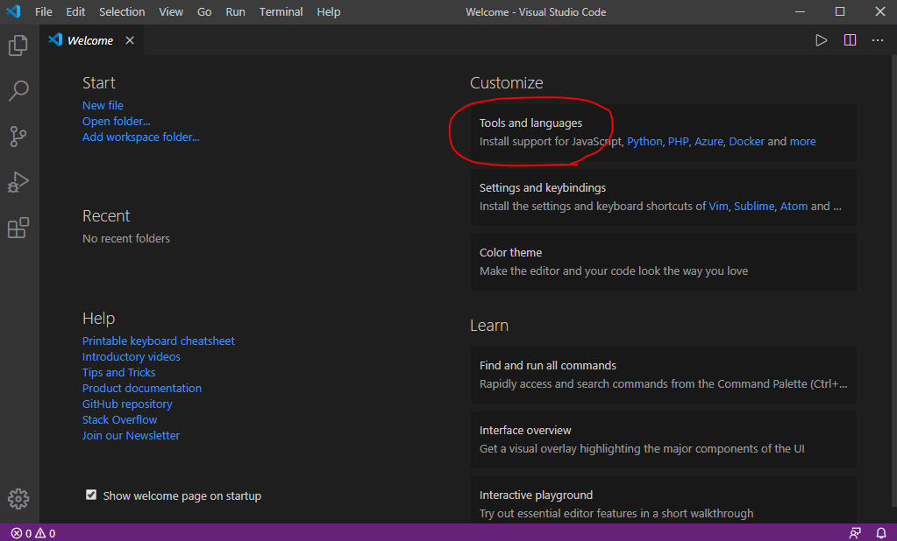
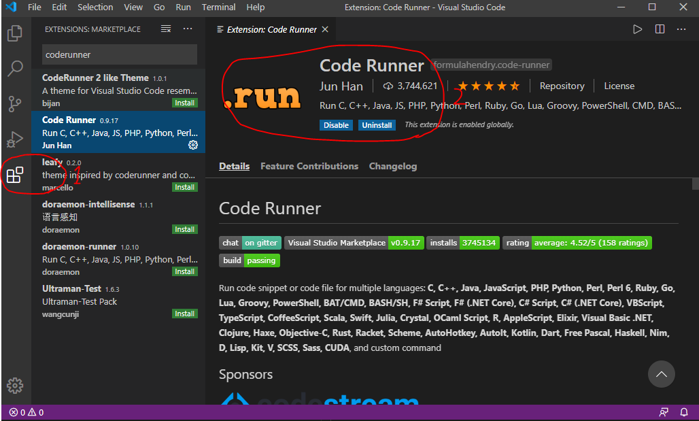
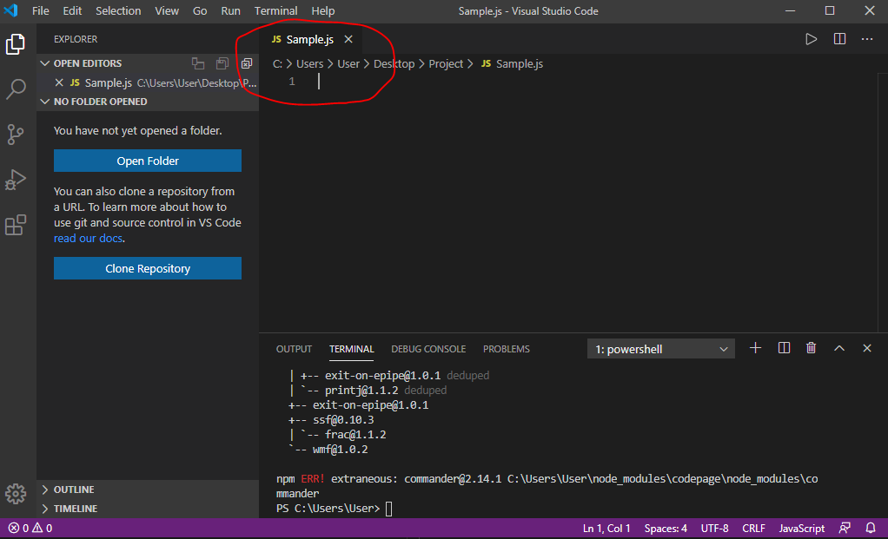
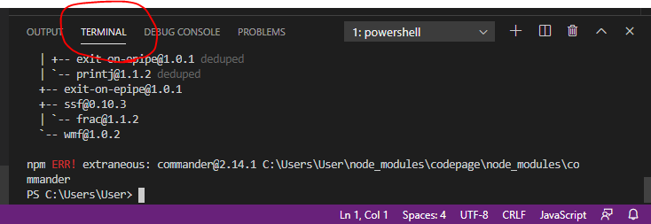
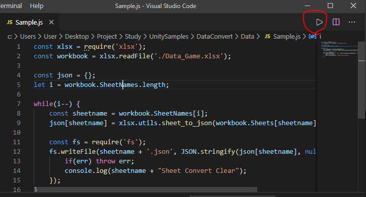
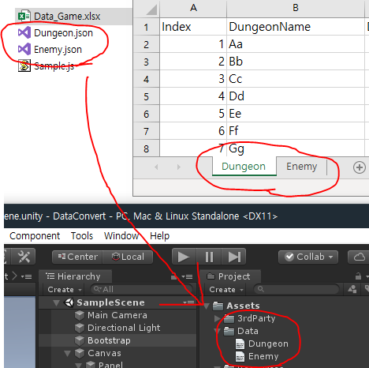

# 유니티에서 엑셀 데이터 다루기

엑셀로 이루어진 데이터를 유니티에서 사용하기 위해 Json으로 변환한 뒤 클래스로 래핑해서 사용해보자

# Prerequisites

* Node.js 설치, [NodeJs](https://nodejs.org/ko/)
* Unity3d 설치, [Unity3d](https://unity3d.com/kr/get-unity/download)
* VS Code 설치 [VS Code](https://code.visualstudio.com/download)
* MiniJSON 필요, [MiniJSON](https://gist.github.com/darktable/1411710)

# How to use

1. NodeJs 설치, VS Code에서 JavaScript 언어 설치


2. VS Code - Extension으로 이동후 `Code Runner` 설치


3. 자바스크립트 파일 `.js` 생성


4. 터미널에 라이브러리 설치를 위한 명령어 입력, Node.js를 설치했다면 패키지 매니저인 npm이 설치 되었을거라고 가정, 만약 설치가 안되어 있다면 설치 후 아래 명령어 입력 - [SheetJs Github](https://github.com/SheetJS/sheetjs)


```js
// Sheetjs 라고 하는 엑셀을 json으로 바꿔주는 라이브러리
npm install xlsx 
```

5. 아래 스크립트 작성후 코드 Run, 단 엑셀이 미리 준비되어 있어야 함

```js
const xlsx = require('xlsx');
// 현재 읽을 엑셀
const workbook = xlsx.readFile('./Data_Game.xlsx');

const json = {};
let i = workbook.SheetNames.length;

while(i--) {
    const sheetname = workbook.SheetNames[i];
    json[sheetname] = xlsx.utils.sheet_to_json(workbook.Sheets[sheetname]);

    // 엑셀의 각 시트당 하나씩 .json 파일 생성
    const fs = require('fs');
    fs.writeFile(sheetname + '.json', JSON.stringify(json[sheetname], null, 2), (err) => {
        if(err) throw err;
        console.log(sheetname + "Sheet Convert Clear");
    });
}
```



6. 엑셀 파일이 위치한 폴더에 시트당 하나씩 `.json` 파일이 생성되고 해당 파일을 `Assets/Data` 밑으로 이동 (다른 폴더나 경로에 놓아도 상관없는데 현재 코드가 그렇게 되어있음) 나중에 `.bat`으로 자동화하면 좋을듯



7. 유니티 데이터에서 상단 툴바에 `Tools - Convert GameData` 클릭, `Data_Game.json` 생성 `Play` 하면 해당 데이터를 이용한 예제 확인 가능

p.s : 다른 시트의 데이터를 사용하고 싶다면 데이터 클래스 생성후 다른 데이터 클래스와 구조를 맞춘뒤, `LocalGameData`에 클래스를 추가하는 작업을 해주어야함

후기 : 좀더 고급지게 만들고 싶었는데 엑셀을 Json으로 만드는것 부터 난관이였다. 이것저것 찾아봤는데 마땅한게 없어서 어느정도 타협점을 찾고 대충 C#으로 해결하였음
